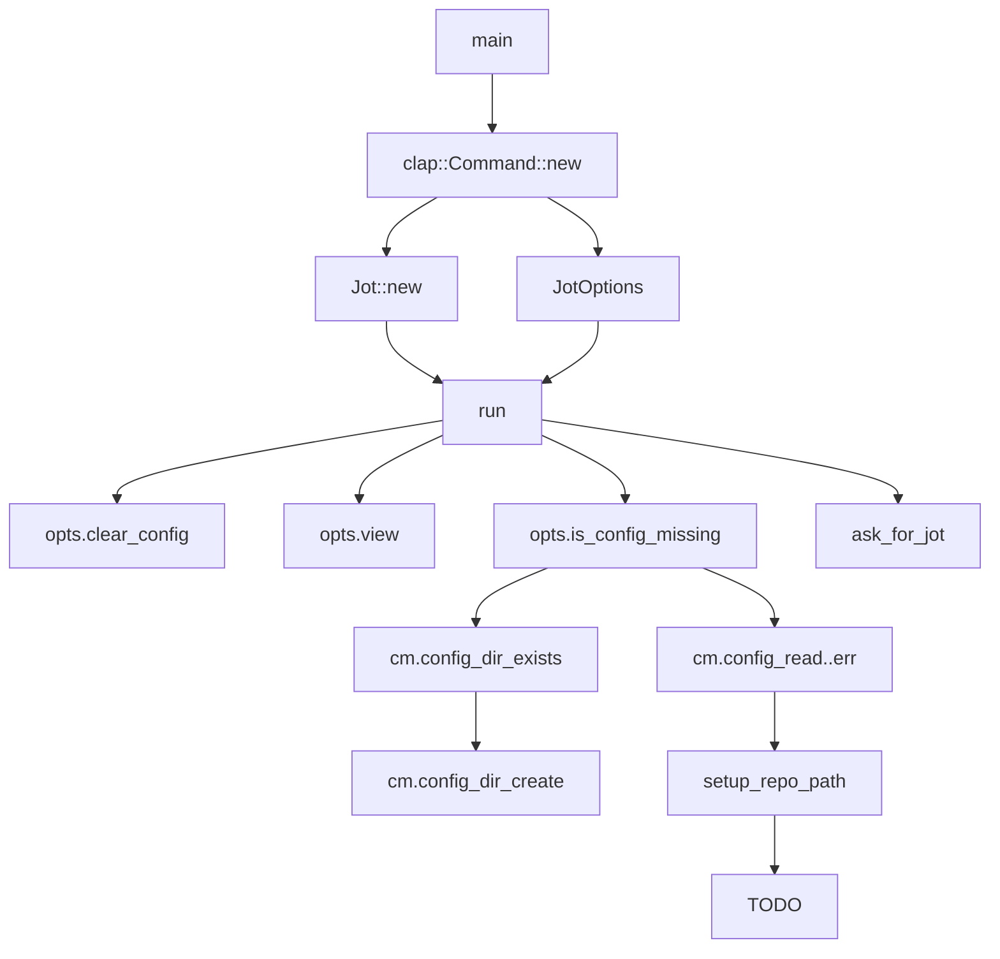

# Jot

Jot allows you to jot down anything and upload it to a repository.

Version control your jots efficiently.

A fork of [eureka](https://github.com/simeg/eureka).

## Structure

### main

```mermaid
graph TD;
main --> clap::Command::new;
clap::Command::new --> Jot::new;
clap::Command::new --> JotOptions;
Jot::new --> run;
JotOptions --> run;
run --> opts.clear_config;
run --> opts.view;
run --> opts.is_config_missing;
run --> ask_for_jot;
opts.is_config_missing --> cm.config_dir_exists -->  cm.config_dir_create;
opts.is_config_missing --> cm.config_read..err -->  setup_repo_path;
setup_repo_path --> TODO;
```
