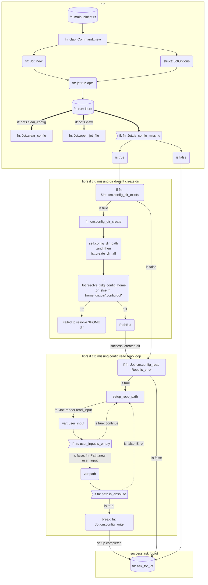
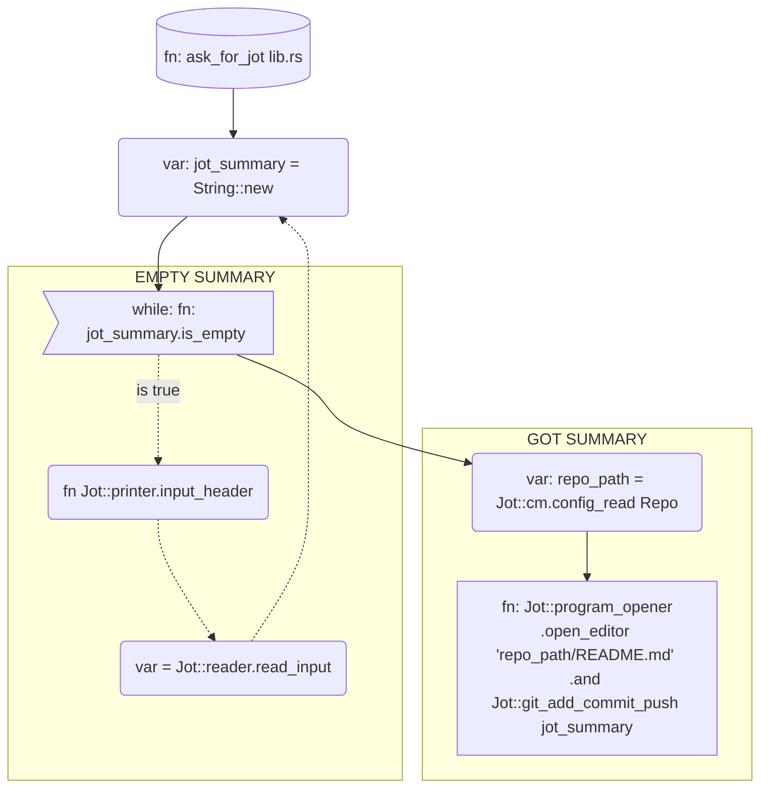

# Jot

Jot allows you to jot down anything and upload it to a repository.

Version control your jots efficiently with git and github(optional).

A fork of [eureka](https://github.com/simeg/eureka).

## Structure

<!-- https://jojozhuang.github.io/tutorial/mermaid-cheat-sheet/  -->

### Level 1

### Level 2

let repo_path = self.cm.config_read(Repo)?;

self.program_opener
.open_editor(&format!("{}/README.md", &repo_path))
.and(self.git_add_commit_push(jot_summary))

subgraph Z
od>Odd shape]-- Two line edge comment --> ro
di{Diamond with   line break} -.-> ro(Rounded square shape)
di==>ro2(Rounded square shape)
end
