# Jot

Jot allows you to jot down anything and upload it to a repository.

Version control your jots efficiently with git and github(optional).

A fork of [eureka](https://github.com/simeg/eureka).

## Setup

### Path

```bash
$ jot
############################################################
####                  First Time Setup                  ####
############################################################

This tool requires you to have a repository with a README.md
in the root folder. The markdown file is where your jots
will be stored.
Once first time setup has completed, simply run Jot again
to start jotting down your snippets, haiku, tips & tricks.

Absolute path to your repository
> /$HOME/path/to/repository/
```

-   `user_input` - path `/$HOME/path/to/your/repository/`
-   Links and Writes `user_input` `Repo` path to config in `~/.config/jot/config.json`.

### Jot Summary

```bash
$ jot
>> Jot summary
> Hello, world
Adding and committing you new jot to main..
```

## Structure

<!-- https://jojozhuang.github.io/tutorial/mermaid-cheat-sheet/  -->

### Mermaid Flowchart

```mermaid
graph TD;

%%subgraph main rs main run
A[("main() bin/jot.rs")]==>A1["clap::Command::new()"];
    A1-->A11("let mut jot = Jot::new()");
    A11-->A2("jot.run(opts)")-->B;
    A1-->A12("let opts = JotOptions{..}")-->A2;
    B[("main.rs<br>jot.run(opts)<br>lib.rs")] ==> BCLEARCFG;
    B===>BCFGMISS>"if Jot::is_config_missing()"];
    BCLEARCFG>"if opts.clear_config()"]-->|true|BCLEARCFGfn["Jot::clear_config()"];
    B==>BVIEW>"if opts.view()"]-->|true|BVIEWfn["fn: Jot::open_jot_file()"];
    BCFGMISS-->|true|B31B;
    BCFGMISS-->|false|E;
%%end

%% Lead to fn if config_read
%%subgraph lib rs if cfg missing dir doesnt create dir
    B31B>"if !Jot::cm.config_dir_exists()"];
    B31B-->|"true:<br>
        Jot::cm.config_dir_create()<br><br>
        CM::cm::config_dir_path()<br>
        .and_then(fs::create_dir_all)
        "|B3AB;
    B3AB("CM::cm::resolve_xdg_config_home()<br>
        .or_else(|| Some(home_dir()?<br>
        .join('.config').join('jot')))
        ");
    B3AB-.->|Err|B3AB2(".ok_or_else(|| ErrorKind::NotFound,<br>
        'unresolved $HOME directory')
        ");
    B3AB-->|Ok|B3AB1("PathBuf: `~/.config/config.json`");
    B3AB1-->|success: created dir|B31A;
    B31B-->|is false|B31A;
    B31A>"if Jot::cm.config_read(Repo).is_error()"]-->|is true|CSetupRepo;
%%end
%%subgraph lib rs if cfg missing config read repo loop
%% Get user input for repository path

    D1-."false: <br>Error".->CSetupRepo;
    C11-."
        true: <br>
        continue 'prompt loop
        "..-> CSetupRepo["Jot::setup_repo_path()?"];
    CSetupRepo-->|"'prompt: loop<br>
        Jot::printer.input_header('Absolute path jot repo')<br>
        let user_input = Jot::reader.read_input() <br>
        R::read_input()
        "|C11;
    C11>"if user_input.is_empty()"];
    C11-->|"false:<br>let path = Path::new(user_input)"|D1;
    D1>"if path.is_absolute()"];
    D1-->|"true:<br>
        break 'prompt <br>
        Jot::cm.config_write(Repo, path.display()) <br>
        setup completed
        "|E;
    B31A-->|"false"|E;
%%end


%%subgraph lib rs success ask for jot summary
    E{{"Jot::ask_for_jot() lib.rs"}}-->FvarJotSumary;
    %% have no summary from user
    FvarJotSumary(var: jot_summary =<br> String::new)==>GWhileLoop;
    %% WHILE LOOP
    GWhileLoop>while: fn: jot_summary.is_empty]-.->|true: is_empty|GWhilePrinter;
    %% Got summary from user
    GWhilePrinter(fn Jot::printer.input_header);
    G11(jot_summary =<br> Jot::reader.read_input)-.->GWhileLoop;
%%end

%%subgraph lib rs success ask for jot repo path
    GWhileLoop==>|false: is_empty, got summary|HRepoPath;
    HRepoPath(var: repo_path = Jot::cm.config_read Repo);
    HRepoPath==>HJOTgitinitrepo("Jot::git.init(repo_path)<br>
        .map_err(git_err Error::new)<br>
        ErrorKind::InvalidInput, git_err))
        ");
    %% Open editor then, add, commit and push to git
%%end

%%subgraph lib rs success commit push summary
    %% Success
    FINAL[["Jot::program_opener<br>
            .open_editor('{repo_path}/README.md')<br>
            .and(Jot::git_add_commit_push(jot_summary)
        "]];
%%end



%% GIT(checkout_branch in gitrs).->GIT1-.->H;
 %% git2::Repository::open(Path::new(&repo_path)).map(|repo| self.repo = Some(repo))
%%subgraph git rs
    GITinit("Git::Repository::open(repo_path)<br>
        .map(self.repo = Some repo)")==>|"Ok"|FINAL;
    GITinit-.->|Err|HJOTgitinitrepo;
    HJOTgitinitrepo-->GITinit;
%%end


%%subgraph printer rs
    PRINT1-.->G11;
    GWhilePrinter-.->PRINT;
    PRINT(fn: Printer::println_styled)-.->PRINT1(fn: Printer::writer.flush);
%%end

classDef gray fill:#888,stroke:#ccc,stroke-width:2px
classDef cyan fill:#a88,stroke:#ccc,stroke-width:2px
%% class E,I,FINAL gray
%% class FvarJotSumary,HRepoPath cyan
```


