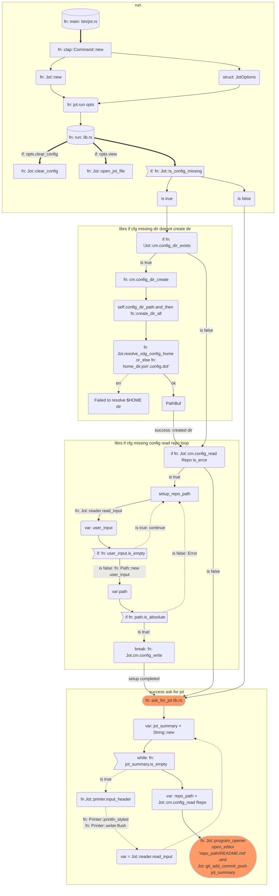

# Jot

Jot allows you to jot down anything and upload it to a repository.

Version control your jots efficiently with git and github(optional).

A fork of [eureka](https://github.com/simeg/eureka).

## Structure

<!-- https://jojozhuang.github.io/tutorial/mermaid-cheat-sheet/  -->

### Level 1

